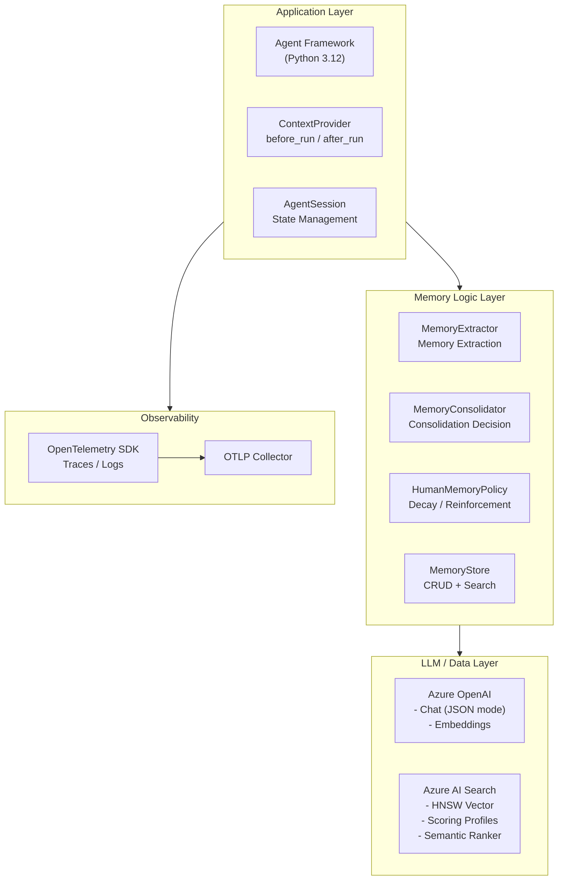
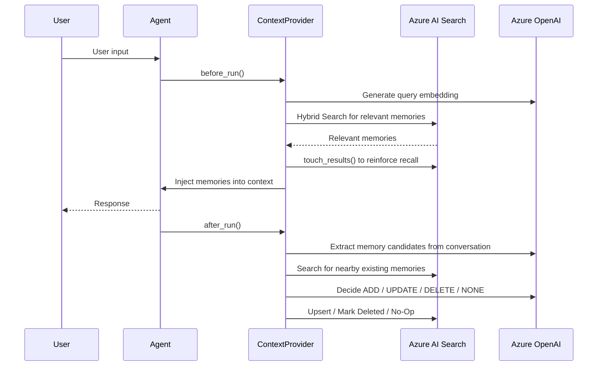

# Extending Microsoft Agent Framework Memory with Azure AI Search to Build a Production-Ready Long-Term Memory Foundation

I have been running the [Microsoft Agent Framework Workshop](https://github.com/nohanaga/microsoft-agent-framework-workshop-1.0.0) with several engineers, and memory has become one of the most active discussion topics. Based on the feedback from those discussions, I put together the implementation approach described in this article.

Microsoft Agent Framework provides built-in providers such as `MemoryContextProvider` and `Mem0ContextProvider`. In practice, however, it is common to run into requirements that are not covered out of the box. To address that, I combined Microsoft Agent Framework with Azure AI Search and designed a custom memory layer for agents, with behavior closer to human memory.

As part of this implementation, I added two new ranking policies specialized for memory retrieval: `RankingProfile.IMPORTANT` and `RankingProfile.RECENT`.

## Why Custom Memory Is Needed

If you want an AI agent to remember preferences shared in a previous conversation, a general-purpose memory library such as Mem0 is one option. However, once you move toward production usage, the following requirements often become difficult to control with a generic library:

- Change retrieval ranking based on memory **importance** and **freshness**
- Automatically fade out old memories and keep them out of the candidate set passed to the agent, in other words, implement **forgetting**
- Fully use Azure AI Search features such as **scoring profiles**, date filters, category filters, and semantic ranking
- Make the logic for adding, updating, and deleting memories transparent

This article introduces an architecture that extends `ContextProvider` in Microsoft Agent Framework v1.4.0 and directly controls an Azure AI Search index as the memory store.

## Architecture Overview



## Sequence Diagram



There are three main design points.

1. **Manage the memory lifecycle with top-level fields**

   Keep `importance`, `retention_score`, `access_count`, and `updated_at` out of a JSON payload so they can be used directly by Azure AI Search filters, sorts, and scoring profiles.

2. **Separate retrieval mode from ranking policy**

   `SearchMode` only describes how candidates are retrieved: keyword, vector, hybrid, or semantic. `RankingProfile`, optimized for memory retrieval, describes ranking policies such as `IMPORTANT` and `RECENT`.

3. **Keep the system usable even without an LLM**

   Memory extraction and consolidation include rule-based fallbacks, so the structure can still be tested even when an LLM is not configured.

## Class Structure

| Class | Responsibility |
|---|---|
| `AzureAISearchMemoryContextProvider` | Extends `ContextProvider`. Runs memory retrieval and injection in `before_run()`, and memory persistence in `after_run()` |
| `AzureAISearchMemoryStore` | Creates the Azure AI Search index, upserts documents, searches, updates state, and applies forgetting |
| `AzureOpenAIMemoryIntelligence` | A thin helper for Azure OpenAI JSON completions and embeddings |
| `MemoryExtractor` | Extracts memory candidates (`MemoryCandidate`) from conversation messages |
| `MemoryConsolidator` | Compares new candidates with existing memories and decides `ADD` / `UPDATE` / `DELETE` / `NONE` |
| `HumanMemoryPolicy` | Policy for time decay, recall reinforcement, and archival decisions |

## Data Model

### MemoryRecord: One Memory Stored in Azure AI Search

```python
@dataclass
class MemoryRecord:
    id: str                          # UUID
    user_id: str                     # User-level isolation
    agent_id: str                    # Agent-level isolation
    memory: str                      # Memory text
    category: str = "general"        # preference / profile / plan, etc.
    importance: float = 0.5          # 0.0-1.0, resistance to forgetting
    confidence: float = 0.7          # Confidence at extraction time
    status: MemoryStatus = "active"  # active / archived / deleted
    retention_score: float = 1.0     # Retention score, decreases through decay
    access_count: int = 0            # Number of recalls
    created_at: datetime             # Creation time
    updated_at: datetime             # Update time
    last_accessed_at: datetime | None  # Last recall time
    expires_at: datetime | None      # Expiration for temporary memories
    embedding: list[float]           # Used for vector search
```

By promoting fields such as `importance` and `retention_score` to top-level fields, Azure AI Search scoring profiles can reference them directly. If these values are hidden inside a `payload` JSON object, as in Mem0-style storage, they become difficult to use for filtering and sorting.

### MemoryStatus: Memory Lifecycle State

| State | Meaning | Included in Search |
|---|---|---|
| `active` | Normal searchable memory | Always included |
| `archived` | Old memory or low retention score | Included only with `include_archived=True` |
| `deleted` | Explicitly deleted or invalidated by contradiction | Not included |

## Retrieval Mode and Ranking Policy: SearchMode / RankingProfile

This design allows retrieval behavior to change depending on the scenario. `IMPORTANT` and `RECENT` are the new policies implemented in this work.

```python
class SearchMode(StrEnum):
    KEYWORD = "keyword"      # Text match
    VECTOR = "vector"        # Semantic similarity
    HYBRID = "hybrid"        # Keyword + vector
    SEMANTIC = "semantic"    # Hybrid + semantic ranker

class RankingProfile(StrEnum):
    NONE = "none"            # No scoring profile
    RECENT = "recent"        # Prefer recently updated memories
    IMPORTANT = "important"  # Prefer importance, retention, and access count
```

### Mapping to Scoring Profiles

| RankingProfile | Internal Profile | Boosted Values |
|---|---|---|
| `IMPORTANT` | `memory-priority` | `importance` (boost=8), `retention_score` (boost=4), `access_count` (boost=4, logarithmic) |
| `RECENT` | `memory-recency` | `updated_at` (boost=8, Freshness 90 days) |
| `NONE` | None | Azure AI Search relevance score only |

The caller-side code stays simple.

```python
options = MemorySearchOptions(
    mode=SearchMode.HYBRID,
    ranking_profile=RankingProfile.IMPORTANT,
    top=5,
    min_retention_score=0.1,
)
results = provider.search_memories("Osaka travel preferences", options=options)
```

### Reference: Managing Scoring Profiles in RAGOps Studio

As a side note, [RAGOps Studio](https://github.com/nohanaga/ragops-studio/blob/main/README.jp.md) lets you manage scoring profiles through a UI.

## Memory Extraction: MemoryExtractor

`MemoryExtractor` extracts memories that should be stored persistently from conversation messages. I have covered memory extraction before, and this implementation follows the same idea by specifying the behavior in the prompt.

https://qiita.com/nohanaga/items/37fbe8dfb35a506b1d5a#%E8%A8%98%E6%86%B6%E3%81%AE%E6%8A%BD%E5%87%BA

### LLM Extraction Mode

Azure OpenAI JSON mode returns a structure like the following.

```json
{
  "memories": [
    {
      "memory": "For Osaka trips, the user prioritizes hotels near the station.",
      "category": "preference",
      "importance": 0.85,
      "confidence": 0.9
    }
  ]
}
```

The extraction targets user preferences, constraints, profile information, and recurring needs. Temporary facts or claims made only by the assistant are excluded.

### Rule Fallback

When the LLM is unavailable, durable utterances are detected with Japanese and English pattern matching. This part is intentionally simple.

```python
durable_patterns = [
    (r"(好き|好み|優先|苦手|嫌い|必要|いつも|毎回)", "preference"),
    (r"(prefer|like|dislike|always|usually)", "preference"),
]
```

The fallback defaults are `importance=0.65`, `confidence=0.55`, and `source="rule-fallback"`.

## Memory Consolidation: MemoryConsolidator

Memory consolidation is also implemented as a fully managed feature in Foundry Agent Service, but in this implementation I build the logic myself. It uses an LLM to merge similar or duplicate topics and avoid storing redundant information.

https://qiita.com/nohanaga/items/536b942b29d9901aeca0#2-%E3%83%A1%E3%83%A2%E3%83%AA%E3%81%AE%E4%BB%95%E7%B5%84%E3%81%BF

The LLM compares a new memory candidate with existing memories and selects one of four events. More specifically, it performs semantic similarity comparison, contradiction detection, and natural-language generation of the merged memory text.

| Event | Meaning | Action |
|---|---|---|
| `ADD` | Save as a new memory | Upsert a new `MemoryRecord` |
| `UPDATE` | Merge into an existing memory | Upsert the existing record after merging the text |
| `DELETE` | Invalidate an existing memory | Change `status` to `deleted` |
| `NONE` | Already covered by an existing memory | Do nothing |

### Decision Flow for Rule Fallback

```text
No nearby memories -> ADD
Exact normalized-text match or score >= 0.92 -> NONE
Looks like a forget/delete instruction -> DELETE
Score >= 0.78 and category matches -> UPDATE
Otherwise -> ADD
```

During `UPDATE`, the implementation uses `max(existing, candidate)` for `importance` and `confidence`, so important memories are not downgraded accidentally.

## Human-Like Memory: HumanMemoryPolicy

As an agent accumulates more memories, old plans or weak preferences may be referenced every time and reduce response quality. `HumanMemoryPolicy` is a mechanism that makes recalled memories easier to keep while gradually making unused memories less visible.

### Retention Score Formula, Simplified

There is certainly more depth to explore from a cognitive science perspective, but for this demo I implemented a simplified version. The retention score is a number from 0.0 to 1.0 representing whether this memory is still worth showing to the agent. As the score drops, the memory is excluded by search filters. When it falls below a threshold, its state transitions to `archived`.

The formula combines three independent factors.

```math
\text{retention\_score} = \text{decay} \times \text{importance\_anchor} + \text{access\_rehearsal}
```

The first product represents the basic remaining value determined by time and importance. The second additive term represents reinforcement based on actual usage.

Definitions of each component:

```math
\text{decay} = 0.5^{\frac{\text{age\_days}}{\text{half\_life\_days}}}
```

```math
\text{importance\_anchor} = 0.35 + 0.65 \times \text{importance}
```

```math
\text{access\_rehearsal} = \min(\text{access\_count} \times 0.04,\ 0.35)
```

In practical terms:

1. The elapsed days since the memory was created determine its basic freshness (`decay`).
2. That freshness is multiplied by the importance weight, producing a base value that reflects both time and importance (`decay * anchor`).
3. Finally, actual usage is added to produce the final score (`+ rehearsal`).

### Recall Reinforcement

Memories used by `before_run()` retrieval are updated through `touch_results()`.

```python
record.last_accessed_at = now
record.access_count += 1
record.retention_score = policy.retention_score(record)
record.status = policy.status_for(record)
```

**Frequently used memories are easier to keep, while unused memories naturally fade out.** This is a simplified model inspired by the Ebbinghaus forgetting curve. This part is interesting because there is plenty of room for customization.

## Connecting to ContextProvider

The implementation extends `ContextProvider` in Agent Framework and overrides `before_run()` and `after_run()`.

```python
from agent_framework import Agent
from agent_framework._sessions import ContextProvider

class AzureAISearchMemoryContextProvider(ContextProvider):
    async def before_run(self, *, agent, session, context, state):
        # 1. Build a query from user input
        # 2. Generate an embedding
        # 3. Search for relevant memories in Azure AI Search
        # 4. Reinforce recall with touch_results()
        # 5. Inject memories into the context with context.extend_messages()

    async def after_run(self, *, agent, session, context, state):
        # 1. Collect input and response messages
        # 2. Extract memory candidates with MemoryExtractor
        # 3. Decide ADD/UPDATE/DELETE/NONE with MemoryConsolidator
        # 4. Apply changes with AzureAISearchMemoryStore
        # 5. Optionally store a forgetting dry-run in state
```

Connecting it to an agent is just a matter of passing it through `context_providers`.

```python
agent = Agent(
    client=create_azure_openai_chat_client(),
    name="TravelAgent",
    instructions="Use relevant memories only when they help answer the user.",
    context_providers=[custom_memory_provider],
)
result = await agent.run("Plan an Osaka trip for me.", session=session)
```

### Context Injection Format

Search results are passed to the agent as a system message.

```yaml
## Relevant memories
Use these memories only when they help answer the user.
1. [preference; importance=0.85; retention=0.91] For Osaka trips, the user prioritizes hotels near the station.
2. [preference; importance=0.70; retention=0.88] The user prefers restaurants with vegetarian options.
```

## Azure AI Search Index Design

### Field Design

| Field | Type | Attributes | Purpose |
|---|---|---|---|
| `id` | String | Key | UUID |
| `user_id` / `agent_id` | String | Filterable, Sortable | Data isolation |
| `memory` / `summary` | String | Searchable | Text search target |
| `category` | String | Searchable, Filterable, Facetable | Category filtering |
| `importance` | Double | Filterable, Sortable, Facetable | Used by scoring profiles |
| `retention_score` | Double | Filterable, Sortable | Retention-score filter |
| `access_count` | Int32 | Filterable, Sortable | Recall count |
| `created_at` / `updated_at` | DateTimeOffset | Filterable, Sortable | Freshness scoring |
| `status` | String | Filterable, Facetable | Search visibility control |
| `embedding` | Collection(Edm.Single) | Vector | HNSW vector search |

### Semantic Configuration

```yaml
content_fields: memory, summary
keyword_fields: category
```

### Data Isolation

The search filter always includes the following condition. Memories must be managed separately for each user, so this kind of filter is required.

```python
user_id eq '<user_id>' and agent_id eq '<agent_id>'
```

This is application-level isolation. In a multi-tenant production environment, you should also consider adding tenant IDs, separating indexes, using RBAC, and keeping audit logs.

## RankingProfile.IMPORTANT vs RankingProfile.RECENT

Even with the same query, the top results change depending on the ranking profile.

```python
# Old but highly important baseline policy that has been referenced many times
record_a = MemoryRecord(
    memory="For Osaka hotels, the baseline preference is to stay within walking distance of takoyaki shops.",
    importance=1.0, access_count=20, days_old=75,
)

# New but low-importance temporary candidate
record_b = MemoryRecord(
    memory="For Osaka hotels, the baseline preference is to stay within walking distance of takoyaki shops.",
    importance=0.05, access_count=0, days_old=0,
)
```

| Mode | Memory Ranked Higher | Reason |
|---|---|---|
| `IMPORTANT` | `record_a` | Strong boost from `importance=1.0` and `access_count=20` |
| `RECENT` | `record_b` | `updated_at` is recent, so the Freshness score is highest |

**How to use them:**

- Prioritize long-term preferences or strong constraints: `ranking_profile=RankingProfile.IMPORTANT`
- Prioritize recent plans or newly added conditions: `ranking_profile=RankingProfile.RECENT`
- Use the normal candidate retrieval method: `mode=SearchMode.HYBRID`

## Forgetting: Dry Run and Maintenance

`apply_forgetting()` retrieves weak memories sorted by `retention_score asc`, then calculates their new score and state.

```python
# Preview candidates only, the default behavior
preview = store.apply_forgetting(policy, dry_run=True, limit=25)

# Actually update the index, typically in a scheduled maintenance job
store.apply_forgetting(policy, dry_run=False, limit=100)
```

This implementation does not physically delete records. If you want to purge documents in the `deleted` state after a certain period, design that as a separate batch process.

## Comparison with General-Purpose Memory

| Perspective | General-Purpose Memory | This Implementation |
|---|---|---|
| Schema control | Managed by the library | Designed by you, with freedom over filters, sorts, and profiles |
| Retrieval ranking | Internal library logic | Azure AI Search scoring profiles |
| Memory state management | Limited | Explicit transitions across `active` / `archived` / `deleted` |
| Forgetting | Manual deletion | Time decay + recall reinforcement + archival |
| Transparency of extraction and consolidation | Black box | Separated into `MemoryExtractor` and `MemoryConsolidator` |
| Fallback | None | Rule-based processing when the LLM is not configured |
| Semantic ranker | Not supported | Available through `SearchMode.SEMANTIC` |

## Current Limitations

These are areas that could be implemented in the future.

| Limitation | Possible Improvement |
|---|---|
| LLM decisions are non-deterministic | Add JSON Schema validation, few-shot examples, and evaluation datasets |
| Fallback embeddings are simple | Require Azure OpenAI embeddings in production |
| No graph structure | Add an entity/fact index or integrate with a graph database |
| No evaluation harness | Add a small evaluation notebook inspired by LoCoMo or LongMemEval |

## Summary

In this article, I implemented agent memory with Azure AI Search.

1. **Memory extraction**: deciding which utterances should be stored as memories
2. **Consolidation decisions**: deciding whether to add, update, delete, or skip
3. **Search and ranking**: passing memory-priority signals to Azure AI Search scoring profiles
4. **Forgetting and retention**: strengthening used memories and weakening old ones

A strength of Azure AI Search is that keyword, vector, hybrid, and semantic search can be combined depending on the use case. Keyword search works well when exact term matching matters. Vector search is useful when you want to catch paraphrases and ambiguous expressions. Hybrid search lets you use both. These approaches can also be combined in an agentic way.

Scoring profiles also allow non-vector fields such as importance, retention score, update time, and access count to affect ranking, not just text relevance. This is a good fit for agent memory retrieval because it helps select memories that are not only semantically close, but also valuable to pass to the user at this moment.

Scoring profiles can be used not only with keyword search, but also with vector queries and hybrid queries. However, the boosted targets are non-vector fields. In other words, vector search can find semantically close candidates, while **scoring profiles reorder them using importance and freshness**.

This flexibility makes Azure AI Search more than a similarity search engine. It can also serve as a multi-role search engine for memory storage. In an agent memory layer, storing the memory text, importance, retention score, access count, and update time as top-level fields enables explainable and controllable memory retrieval.

# GitHub

This notebook was created as part of the Microsoft Agent Framework Workshop series. I plan to integrate it into the following repository later.

https://github.com/nohanaga/microsoft-agent-framework-workshop-1.0.0
